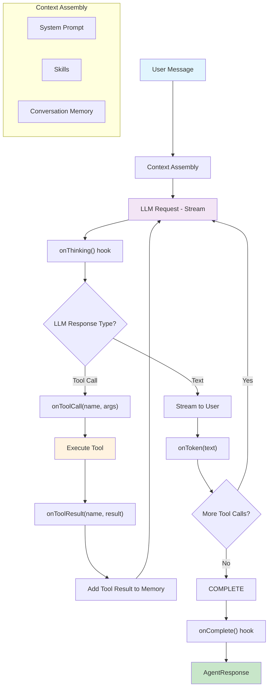

# ZeroAgent

[](https://github.com/ndanhkhoi/zero-agent/actions)
[](https://jitpack.io/#ndanhkhoi/zero-agent)
[](https://ndanhkhoi.github.io/zero-agent/)
[](https://opensource.org/licenses/MIT)

A modular, lightweight Java 17+ framework for building smart Agentic workflows leveraging the OpenAI Chat Completions API.

[Features](#features) • [Getting Started](#getting-started) • [Usage](#usage) • [Documentation](#documentation)

## Requirements

- **Java 17+**
- **OpenAI API Key** (or compatible provider like Groq, Together AI)

## Features

- **Smart Agent Loop**: Handles multi-turn conversations, automatic tool calling, and structured output stream tracking.
- **Provider Agnostic**: Easily swap out the core `LlmClient` to use alternate OpenAI-compatible APIs (Groq, Together, custom clusters) on the fly.
- **Secure Sandboxing**: Provides `JavaScriptTool` powered by Rhino Engine with `ClassShutter` configured to strictly block malicious Java package access out-of-the-box.
- **Agent Skills (`agentskills.io`)**: Load structured folder-based skills combining metadata, focused system prompts, and resources.
- **Vision Support**: Process image inputs simply by passing an `InputStream` and letting the framework handle Base64 mappings.
- **Event Hooks**: Comprehensive lifecycle hooks (`onThinking`, `onToken`, `onToolCall`) for logging, tracing, or bridging to reactive streams.

## Agent Flow



## Documentation

Detailed documentation is available in the `docs/` folder:

- [1. Core Concepts](docs/1-core-concepts.md) - Agent Loop, LlmClient, Event Hooks.
- [2. Tools and Skills](docs/2-tools-and-skills.md) - Custom Tools, Built-in Tools, Agentskills.io.
- [3. Advanced Usage](docs/3-advanced-usage.md) - Custom Memory, Runtime LLM Switching, Vision Protocol.

You can also browse the complete [Javadocs here](https://ndanhkhoi.github.io/zero-agent/).

## Getting Started

ZeroAgent is deployed seamlessly via JitPack, allowing you to easily embed it into your Gradle or Maven builds.

### 1. Add the Repository

Add JitPack to your project's repository list:

<details open>
<summary>Gradle</summary>

```gradle
repositories {
    mavenCentral()
    maven { url 'https://jitpack.io' }
}
```

</details>

<details>
<summary>Maven</summary>

```xml
<repositories>
    <repository>
        <id>jitpack.io</id>
        <url>https://jitpack.io</url>
    </repository>
</repositories>
```

</details>

### 2. Add the Dependency

Include the latest snapshot or release tag of ZeroAgent in your application:

<details open>
<summary>Gradle</summary>

```gradle
dependencies {
    implementation 'com.github.ndanhkhoi:zero-agent:main-SNAPSHOT'
}
```

</details>

<details>
<summary>Maven</summary>

```xml
<dependency>
    <groupId>com.github.ndanhkhoi</groupId>
    <artifactId>zero-agent</artifactId>
    <version>main-SNAPSHOT</version>
</dependency>
```

</details>

## Usage

Here is a quick example of running a simple Agent loop with a custom math tool. The library is built around a flexible `<Builder>` facade that sets up memory, tools, and clients automatically.

```java
import com.github.ndanhkhoi.zeroagent.ZeroAgent;
import com.github.ndanhkhoi.zeroagent.agent.AgentResponse;

public class App {
    public static void main(String[] args) {
        // Initialize the Agent Builder
        ZeroAgent agent = ZeroAgent.builder()
            .apiKey(System.getenv("OPENAI_API_KEY")) // Setup OpenAI Key
            .model("gpt-4o-mini")
            .systemPrompt("You are a helpful and humorous assistant.")
            // Hook into the streaming progress
            .onToken(System.out::print) 
            .build();

        // 1. Send a standard text message
        System.out.println("User: What is the current time?");
        AgentResponse response = agent.message("What is the current time?")
            .sessionId("session-abc")
            .send();
        
        System.out.println("\n---");
        System.out.println("Stats: " + response.toolCallsExecuted() + " tools executed.");
    }
}
```

### Vision Support

If you need the Assistant to interpret an image, you can fluently append it to the chat request:

```java
import com.github.ndanhkhoi.zeroagent.agent.AgentResponse;

// Load an InputStream for the image you want to process
try (InputStream imageStream = Files.newInputStream(Path.of("diagram.png"))) {

    AgentResponse response = agent.message("Can you explain this diagram for me?")
        .sessionId("session-abc")
        .image(imageStream, "image/png")
        .send();
} 
```

> [!WARNING]
> Vision functionalities require using models that specifically support image processing (like `gpt-4o` or `gpt-4-vision-preview`).

### Switch LLM Provider

You can switch to any OpenAI-compatible provider at runtime:

```java
import com.github.ndanhkhoi.zeroagent.llm.OpenAiChatClient;

// Switch to Groq
agent.setLlmClient(OpenAiChatClient.builder()
    .baseUrl("https://api.groq.com/openai/v1")
    .apiKey(System.getenv("GROQ_API_KEY"))
    .build());

// Or use Together AI
agent.setLlmClient(OpenAiChatClient.builder()
    .baseUrl("https://api.together.xyz/v1")
    .apiKey(System.getenv("TOGETHER_API_KEY"))
    .build());
```
